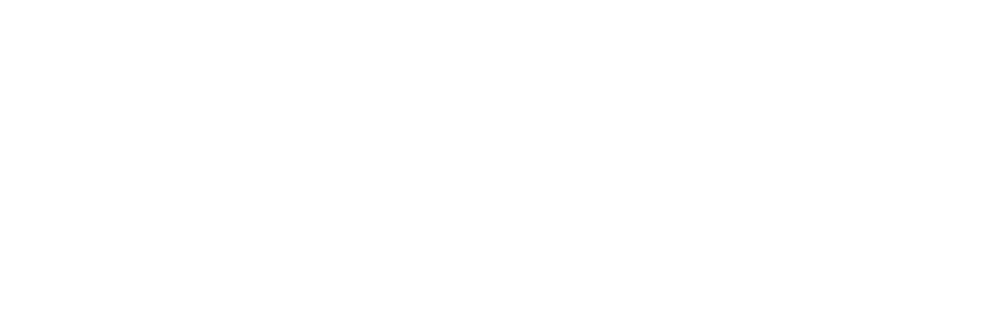
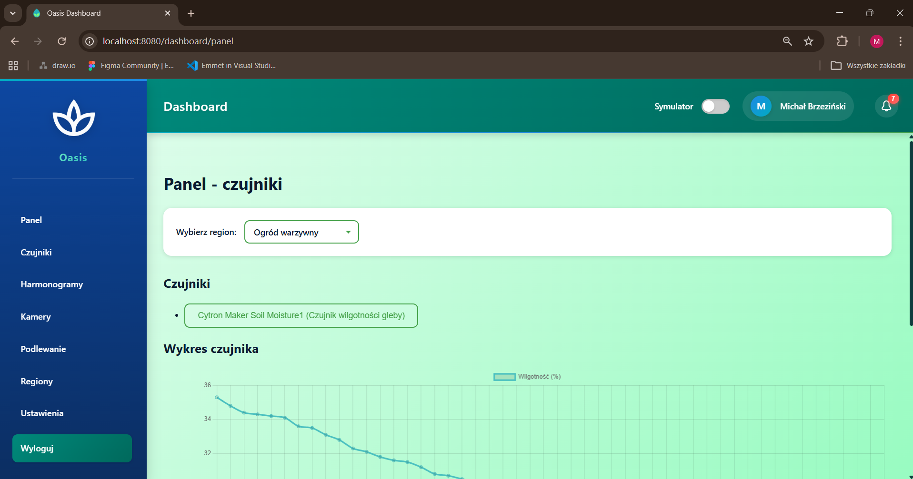
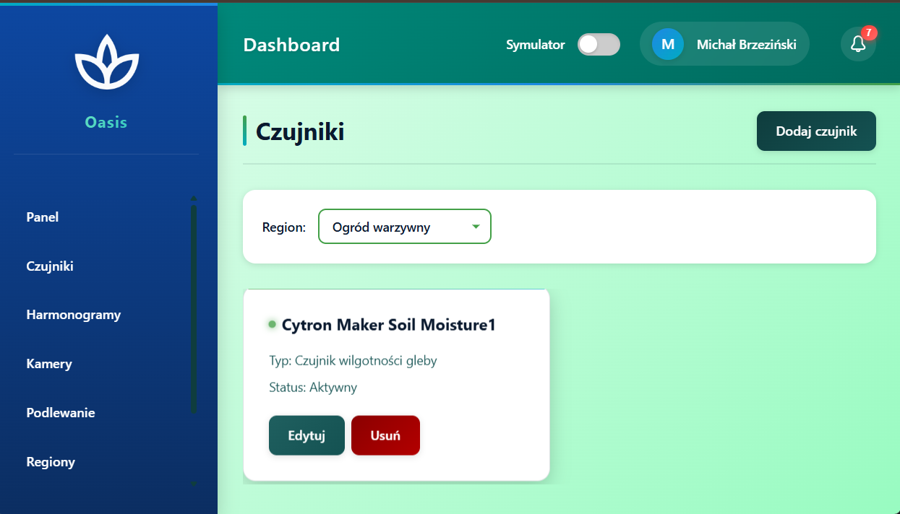
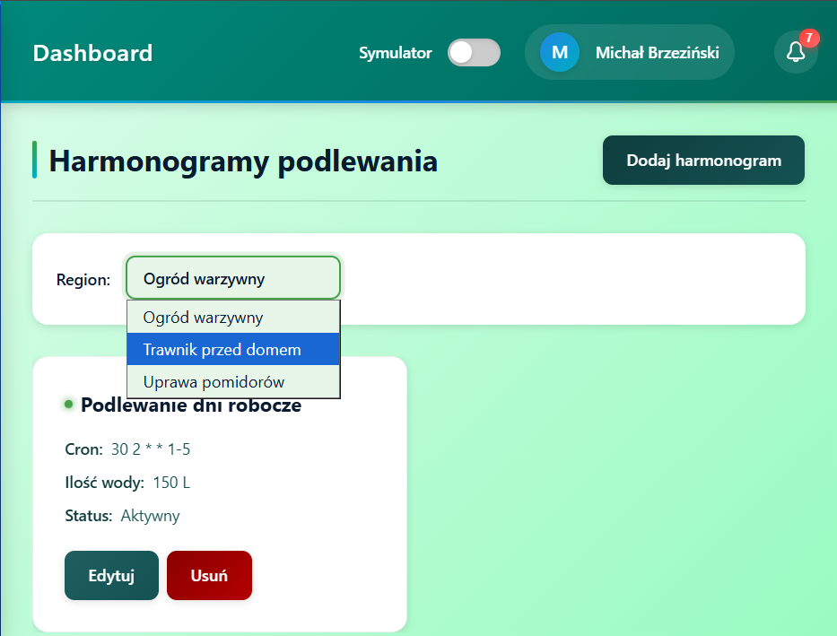
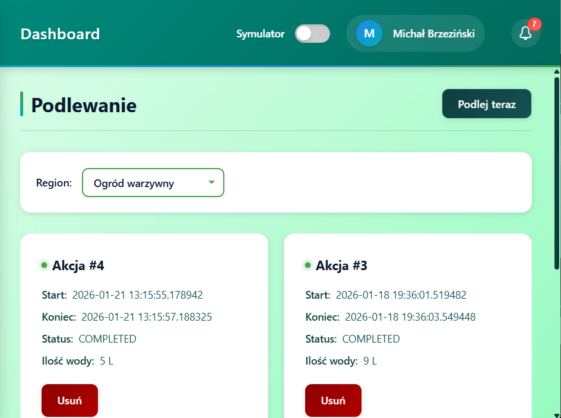
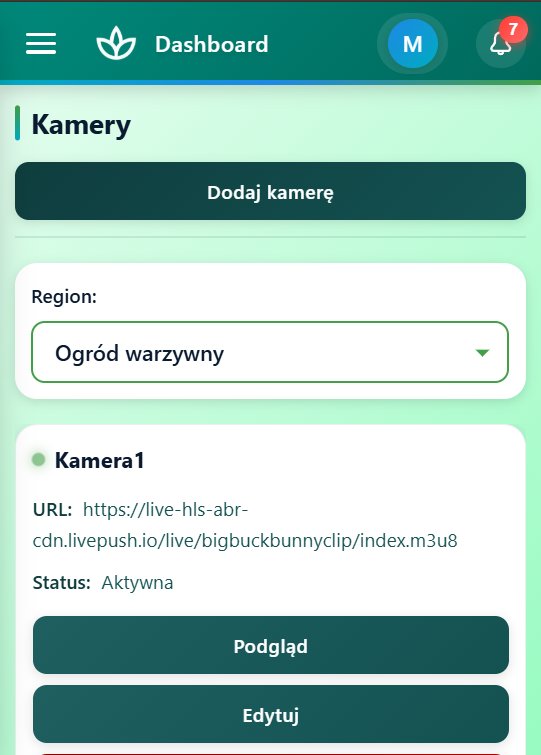
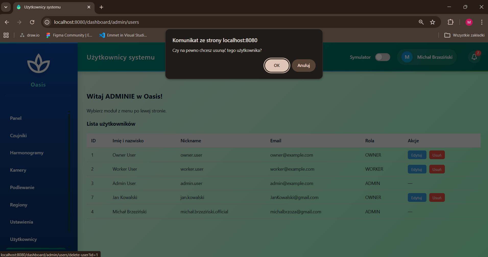

 

#### Oasis® to responsywna aplikacja webowa wspierająca hodowców roślin w monitorowaniu i regulowaniu warunków uprawy. Umożliwia podgląd parametrów środowiskowych (wilgotność, temperatura, pH gleby, nasłonecznienie), kontrolę podlewania ręcznego i automatycznego, zarządzanie czujnikami i kamerami oraz otrzymywanie powiadomień o potrzebie nawadniania. Dzięki logowaniu i szyfrowaniu danych zapewnia bezpieczeństwo użytkowników i działa zarówno na komputerach, jak i urządzeniach mobilnych.

***Zachęcam do zapoznania się z pełną dokumentacją: [Dokumentacja Oasis](documentation/DocumentationFile.pdf)***

## SPIS TREŚCI
- [SPIS TREŚCI](#spis-treści)
- [OPIS](#opis)
- [FUNKCJE](#funkcje)
  - [Logowanie i role użytkowników](#logowanie-i-role-użytkowników)
  - [Dashboard użytkownika](#dashboard-użytkownika)
  - [Panel administratora](#panel-administratora)
  - [System powiadomień](#system-powiadomień)
  - [Symulacja](#symulacja)
- [WIDOKI](#widoki)
  - [Ekran czujników](#ekran-czujników)
  - [Ekran harmonogramów](#ekran-harmonogramów)
  - [Ekran akcji podlewania natychmiastowego](#ekran-akcji-podlewania-natychmiastowego)
  - [Ekran mobilnej wersji dla zakładki kamer](#ekran-mobilnej-wersji-dla-zakładki-kamer)
  - [Ekran zakładki użytkowników Admina](#ekran-zakładki-użytkowników-admina)
- [STRUKTURA PROJEKTU](#struktura-projektu)
- [WYMAGANIA TECHNICZNE](#wymagania-techniczne)
- [URUCHOMIENIE](#uruchomienie)
  - [Przykładowy plik `.env`](#przykładowy-plik-env)
- [AUTOR](#autor)

## OPIS

Oasis to aplikacja webowa stworzona w PHP, która umożliwia właścicielom ogrodów i administratorom systemu zarządzać:

> - czujnikami wilgotności,
> - harmonogramami podlewania,
> - kamerami podglądu,
> - regionami ogrodu,
> - ręcznym i automatycznym podlewaniem,
> - powiadomieniami o niskiej wilgotności,
> - ustawieniami użytkownika.

Aplikacja posiada również panel administratora, który pozwala zarządzać użytkownikami systemu.
Całość działa w architekturze MVC, z wykorzystaniem repozytoriów, kontrolerów i widoków.
Interfejs jest w pełni responsywny i zoptymalizowany pod urządzenia mobilne.

## FUNKCJE

### Logowanie i role użytkowników
- Logowanie z weryfikacją hasła (password_verify)
- Sesje przechowują dane użytkownika i jego rolę
- Role:

| Rola | Uprawnienia |
|:------:|-------------|
|OWNER| standardowy użytkownik|
|ADMIN| dostęp do panelu zarządzania użytkownikami|

### Dashboard użytkownika
- Podgląd regionów i ich wilgotności
- Powiadomienia o niskiej wilgotności
- Podgląd kamer (snapshoty generowane automatycznie)
- Harmonogramy podlewania
- Ręczne sterowanie podlewaniem

### Panel administratora
- Lista wszystkich użytkowników
- Usuwanie użytkowników
- Dostęp tylko dla roli ADMIN

### System powiadomień
- Automatyczne powiadomienia o niskiej wilgotności
- Oznaczanie powiadomień jako przeczytane
- Licznik nieprzeczytanych powiadomień w topbarze

### Symulacja
- Symulacja czujników wilgotności
- Symulacja harmonogramów – CRON (własna implementacja)
- Symulacja snapshotów kamer

## WIDOKI

### Ekran czujników

### Ekran harmonogramów

### Ekran akcji podlewania natychmiastowego

### Ekran mobilnej wersji dla zakładki kamer

### Ekran zakładki użytkowników Admina

## STRUKTURA PROJEKTU

Projekt podzielony jest na warstwy zgodnie z architekturą MVC:

|Komponent/Moduł|Funkcje|
|:-------:|:-----:|
|Web/Controllers|obsługa żądań HTTP, kontrolery (SecurityController, DashboardController, PanelController, SchedulesController, CamerasController, SettingsController).|
|Models|modele domenowe: User, Region, Sensor, Camera, Schedule, WateringAction.|
|Infrastructure|baza danych (PDO), repozytoria (UserRepository, RegionRepository, SensorRepository, CameraRepository, ScheduleRepository, WateringRepository).|
|Systemy pomocnicze|moduł harmonogramu, system powiadomień, moduł analityczny.|

## WYMAGANIA TECHNICZNE

- PHP 8.1+
- PostgreSQL
- Nginx
- Docker

## URUCHOMIENIE

1. Sklonuj repozytorium:
   `git clone https://github.com/Michal-Brzezinski/Oasis`
2. Wykonaj komendę cd oasis (przejdź do katalogu projektu).
3. Skonfiguruj bazę danych (PostgreSQL).
4. Ustaw połączenie bazą danych i usługami poprzez modyfikację docker-compose.yaml oraz pliku `.env`.
5. Uruchom aplikację:
   `docker compose up -d`

### Przykładowy plik `.env`
    # Web (nginx)
    WEB_PORT_EXTERNAL=8080
    WEB_PORT_INTERNAL=80

    # PHP (fpm)
    PHP_PORT_INTERNAL=9000   # typowy port FPM, nie musi być wystawiany na zewnątrz

    # Database (Postgres)
    DB_HOST=db
    DB_NAME=db
    DB_USER=docker
    DB_PASS=docker

    DB_PORT_INTERNAL=5432    # port wewnętrzny w kontenerze
    DB_PORT_EXTERNAL=5433    # port wystawiony na hosta

    # PgAdmin
    PGADMIN_PORT_EXTERNAL=5050
    PGADMIN_PORT_INTERNAL=80

    PGADMIN_DEFAULT_EMAIL=admin@example.com
    PGADMIN_DEFAULT_PASSWORD=admin

    # App environment
    APP_ENV=de

## AUTOR

Michał – Student Politechniki Krakowskiej, pasjonat czystej architektury, wzorców projektowych i skalowalnych systemów.